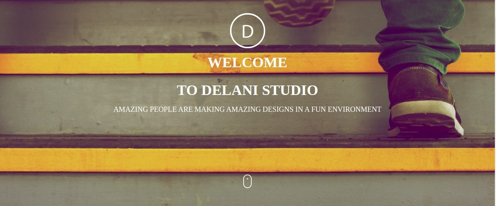

  # THE DELANI STUDIO

# AUTHORS NAME
Jimmy-oss
# PROJECT NAME
The Delani studio
# DESCRIPTION 
Project to create a landing page for a fictional design studio. 
The site illustrates what projects are done by the design studio.
It includes a portfolio of some of their projects, and a detailed description of what they do from inception to completion of the project.
The website incorporates bootstrap styling, jQuery effects and also an embedded form from mail chimp API to track all the emails and messages from the site users.
# TECHNOLOGIES USED
<ul>
 <li>html-program</li>
 <li>Css&bootstrap</li>
 <li>Javascript</li>
 <li>Jquery</li>
 <li>Mailchimp-AIP</li>
    </ul>
 
# BEHAVIOUR DRIVEN DEVELOPMENT
Displays Form For Entering Name and Email
    <ul>
  <li>INPUT: "User's Name Entered"</li>
  <li>INPUT: "User's Email Entered"</li>
  <li>OUTPUT:"Displays to the user through a pop up that we have received their message and also thank them for contacting us"</li>
        </ul>
   Displays an Error Message if Name Input Left Blank
      <ul>
  <li>INPUT: ""</li>
  <li>OUTPUT:"Displays Error Message"</li>
       </ul>
  Displays an Error Message if Email Input Left Blank
      <ul>
 <li>INPUT: ""</li>
 <li>OUTPUT:"Display an Error Message"</li>
  Submit Form and Reset the Message on Click
 <li>INPUT: "Click Submit Button"</li>
 <li>OUTPUT:"Submits the Form"</li>
        </ul>
 # SETUP INSTRUCTIONS
   <li>The project requires jquery effects so as to link the html file and the file itself inorder to create a fictional output.</li>
   <li>It also links when you as the user fill the form you will be able to receive a Thankyou! output note from its source</li>
   <li>It also requires one to link the js file and the html file so as it will be able run smoothly.</li>
 # THE PROJECT LICENSE IS UNDER MIT
 
 MIT License

Copyright (c) 2020 jimmy-oss

Permission is hereby granted, free of charge, to any person obtaining a copy
of this software and associated documentation files (the "Software"), to deal
in the Software without restriction, including without limitation the rights
to use, copy, modify, merge, publish, distribute, sublicense, and/or sell
copies of the Software, and to permit persons to whom the Software is
furnished to do so, subject to the following conditions:

The above copyright notice and this permission notice shall be included in all
copies or substantial portions of the Software.

THE SOFTWARE IS PROVIDED "AS IS", WITHOUT WARRANTY OF ANY KIND, EXPRESS OR
IMPLIED, INCLUDING BUT NOT LIMITED TO THE WARRANTIES OF MERCHANTABILITY,
FITNESS FOR A PARTICULAR PURPOSE AND NONINFRINGEMENT. IN NO EVENT SHALL THE
AUTHORS OR COPYRIGHT HOLDERS BE LIABLE FOR ANY CLAIM, DAMAGES OR OTHER
LIABILITY, WHETHER IN AN ACTION OF CONTRACT, TORT OR OTHERWISE, ARISING FROM,
OUT OF OR IN CONNECTION WITH THE SOFTWARE OR THE USE OR OTHER DEALINGS IN THE
SOFTWARE.
